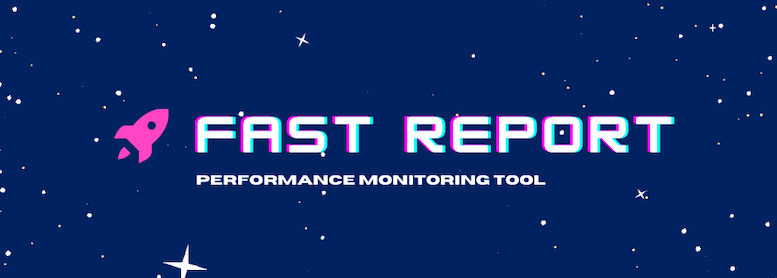

<p align="center">
  
</p>

## Features

- Define your test suites with multiple urls and baseline configs.
- Get a complete score report and alerts on email and slack by just calling a single endpoint.
- Detect what changes are causing the performance drops by adding the tool to your CI/CD workflows.
- Easy to use Web UI for querying config and triggering tests.
- Open source, reliable and ready to self host. 🚀

## Sample alerts

### Email


### Slack


## Requirements

1. Must have node installed v16 or above
2. Must have redis installed, tool internally uses redis-smq.

## Usage guide

### Setup

- Create a `.env` file by copying contents from `sample.env` and provide the required env variables.
- Set the config for your website in the `store/index.ts` file, add the urls you want to test and set a baseline score for different urls based on devices, set alert config for email and slack. Sample config below to use as a reference.
- Start the server : `npm run build` and `node dist/index.js`.

### Triggering tests

GET `/api/trigger?apiKey=<your_api_key>` to trigger the performance tests, after completion of report you receive reports on your alertConfigs like email and slack channel.

### Status Updates

### Realtime

Get realtime update on status by establishing a socket connection with the server, by first initiating a socket connection request to `/socket.io` endpoint and then emitting a `join` event with body as `{"clientId" : "your_api_key"}`, this will give realtime updates as your workflow goes through different processing.

### Polling

GET `/api/status?apiKey=<your_api_key>` to poll for status of the running tests.

## Defaults

The tool is pre configured to use `Performance` as the default category for test and `Desktop` as the default startegy, you can provide query params in API Get Request to change the behaviour.

For eg : `GET /api/trigger/YOUR_CONFIG_ID?category=performance,seo&startegy=mobile`, this will respond with a report containing both performance and seo score of the urls for mobile strategy.

## Sample Config

```ts
import { PSIStrategy } from '../types';

export const baselineStore = [
  {
    id: 'DA0524CF-3073-4346-ACDA-F5816650FE8A', // acts like a primary key for a test suite
    [PSIStrategy.MOBILE]: {
      baselineConfig: [
        {
          url: 'https://www.google.com', // url from configStore urls array
          performance: 0.9, // score category key like performance, seo, accessibility , best-practises
        },
        {
          url: 'https://www.docs.google.com',
          performance: 0.75,
          seo: 0.8,
        },
      ],
    },
    [PSIStrategy.DESKTOP]: {
      baselineConfig: [
        {
          url: 'https://www.google.com',
          performance: 0.8,
        },
        {
          url: 'https://www.docs.google.com',
          performance: 0.65,
          seo: 0.8,
        },
      ],
    },
  },
];

export const configStore = [
  {
    id: 'DA0524CF-3073-4346-ACDA-F5816650FE8A', // ID (can be any string) for associating baseline with config
    urls: ['https://www.google.com', 'https://docs.google.com'], // urls to be included in the test suite
    alertConfig: {
      email: {
        id: 'your@email.com', // insert a valid email ID where you would like to get alerts
        enabled: true, // email alerts enabled
      },
      slack: {
        id: 'slack_channel_url', // insert a slack webhook url to post data to
        enabled: false, // slack alerts disabled
      },
    },
  },
];
```

## Contributing guide

<i>Every contribution counts!</i>

1. Create a fork and checkout a branch different from main
2. Create an issue if the issue you are trying to solve does not exists.
3. Open a PR and wait for review.

```python
  if not issue_exists:
    open_issue()

  assign_issue('yourself')
  create_fork()
  checkout_branch('not-main')
  open_pr('issue-id')
```
